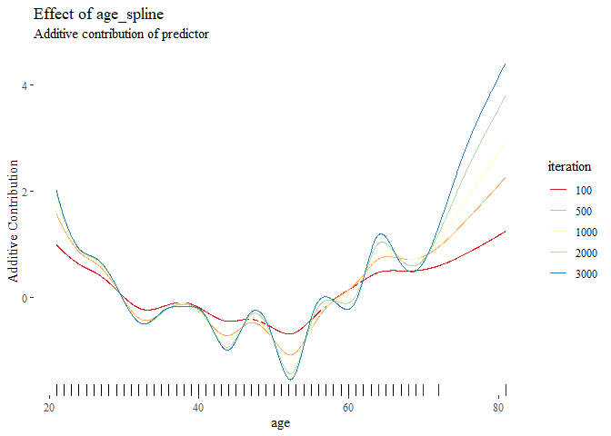

<!-- README.md is generated from README.Rmd. Please edit that file -->

# compboost: Fast and Flexible Component-Wise Boosting Framework <a href='https://danielschalk.com/compboost/'></a>

[](https://travis-ci.org/schalkdaniel/compboost)
[](https://ci.appveyor.com/project/schalkdaniel/compboost)
[](https://coveralls.io/github/schalkdaniel/compboost?branch=master)
[](#license)
[](https://cran.r-project.org/package=compboost)
[](http://joss.theoj.org/papers/94cfdbbfdfc8796c5bdb1a74ee59fcda)

[Documentation](https://danielschalk.com/compboost/) | [Contributors](CONTRIBUTORS.md)
| [Release Notes](NEWS.md)

## Overview

Component-wise boosting applies the boosting framework to statistical
models, e.g., general additive models using component-wise smoothing
splines. Boosting these kinds of models maintains interpretability and
enables unbiased model selection in high dimensional feature spaces.

The `R` package `compboost` is an alternative implementation of
component-wise boosting written in `C++` to obtain high runtime
performance and full memory control. The main idea is to provide a
modular class system which can be extended without editing the source
code. Therefore, it is possible to use `R` functions as well as `C++`
functions for custom base-learners, losses, logging mechanisms or
stopping criteria.

For an introduction and overview about the functionality visit the
[project page](https://schalkdaniel.github.io/compboost/).

## Installation

#### CRAN version:

``` r
install.packages("compboost")
```

#### Developer version:

``` r
devtools::install_github("schalkdaniel/compboost")
```

## Examples

The examples are rendered using <code>compboost 0.1.1</code>.

The fastest way to train a `Compboost` model is to use the wrapper
functions `boostLinear()` or
`boostSplines()`:

``` r
cboost = boostSplines(data = iris, target = "Sepal.Length", loss = LossQuadratic$new())
```

For more extensive examples and how to use the `R6` interface visit the
[project
page](https://danielschalk.com/compboost/articles/getting_started/use_case.html).

<!--

To be as flexible as possible one should use the `R6` API do define base-learner, losses, stopping criteria, or optimizer as desired. Another option is to use wrapper functions as described on the [project page](https://schalkdaniel.github.io/compboost/).


```r
library(compboost)

# Check installed version:
packageVersion("compboost")
#> [1] '0.1.1'

# Load data set with binary classification task:
data(PimaIndiansDiabetes, package = "mlbench")
# Create categorical feature:
PimaIndiansDiabetes$pregnant_cat = ifelse(PimaIndiansDiabetes$pregnant == 0, "no", "yes")

# Define Compboost object:
cboost = Compboost$new(data = PimaIndiansDiabetes, target = "diabetes", loss = LossBinomial$new())
cboost
#> 
#> Component-Wise Gradient Boosting
#> 
#> Trained on PimaIndiansDiabetes with target diabetes
#> Number of base-learners: 0
#> Learning rate: 0.05
#> Iterations: 0
#> 
#> LossBinomial Loss:
#> 
#>   Loss function: L(y,x) = log(1 + exp(-2yf(x))
#> 
#> 

# Add p-spline base-learner with default parameter:
cboost$addBaselearner(feature = "pressure", id = "spline", bl_factory = BaselearnerPSpline)

# Add another p-spline learner with custom parameters:
cboost$addBaselearner(feature = "age", id = "spline", bl_factory = BaselearnerPSpline, degree = 3,
  n_knots = 10, penalty = 4, differences = 2)

# Add categorical feature (as single linear base-learner):
cboost$addBaselearner(feature = "pregnant_cat", id = "category", bl_factory = BaselearnerPolynomial,
  degree = 1, intercept = FALSE)

# Check all registered base-learner:
cboost$getBaselearnerNames()
#> [1] "pressure_spline"           "age_spline"               
#> [3] "pregnant_cat_yes_category" "pregnant_cat_no_category"

# Train model:
cboost$train(1000L, trace = 200L)
#>    1/1000   risk = 0.68  
#>  200/1000   risk = 0.65  
#>  400/1000   risk = 0.64  
#>  600/1000   risk = 0.64  
#>  800/1000   risk = 0.64  
#> 1000/1000   risk = 0.64  
#> 
#> 
#> Train 1000 iterations in 0 Seconds.
#> Final risk based on the train set: 0.64
cboost
#> Component-Wise Gradient Boosting
#> 
#> Trained on PimaIndiansDiabetes with target diabetes
#> Number of base-learners: 4
#> Learning rate: 0.05
#> Iterations: 1000
#> Offset: 0.3118
#> 
#> LossBinomial Loss:
#> 
#>   Loss function: L(y,x) = log(1 + exp(-2yf(x))
#> 
#> 

cboost$getBaselearnerNames()
#> [1] "pressure_spline"           "age_spline"               
#> [3] "pregnant_cat_yes_category" "pregnant_cat_no_category"

selected_features = cboost$getSelectedBaselearner()
table(selected_features)
#> selected_features
#>               age_spline pregnant_cat_no_category          pressure_spline 
#>                      448                      130                      422

params = cboost$getEstimatedCoef()
str(params)
#> List of 4
#>  $ age_spline              : num [1:14, 1] 3.717 1.5152 0.669 -0.6627 -0.0277 ...
#>  $ pregnant_cat_no_category: num [1, 1] -0.41
#>  $ pressure_spline         : num [1:24, 1] -0.969 -0.403 0.14 0.537 0.644 ...
#>  $ offset                  : num 0.312

cboost$train(3000)
#> 
#> You have already trained 1000 iterations.
#> Train 2000 additional iterations.

cboost$plot("age_spline", iters = c(100, 500, 1000, 2000, 3000)) +
  ggthemes::theme_tufte() +
  ggplot2::scale_color_brewer(palette = "Spectral")
```
<p align="center">
  
</p>
 -->

## Benchmark

To get an idea of the performance of compboost, we have conduct a small
benchmark in which compboost is compared with mboost. For this purpose,
the runtime behavior and memory consumption of the two packages were
compared. The results of the benchmark can be read
[here](https://github.com/schalkdaniel/compboost/tree/master/benchmark).

## Citing

To cite `compboost` in publications, please use:

> Schalk et al., (2018). compboost: Modular Framework for Component-Wise
> Boosting. Journal of Open Source Software, 3(30), 967,
> <https://doi.org/10.21105/joss.00967>

    @article{schalk2018compboost,
      author = {Daniel Schalk, Janek Thomas, Bernd Bischl},
      title = {compboost: Modular Framework for Component-Wise Boosting},
      URL = {https://doi.org/10.21105/joss.00967},
      year = {2018},
      publisher = {Journal of Open Source Software},
      volume = {3},
      number = {30},
      pages = {967},
      journal = {JOSS}
    }

## Testing

### On your local machine

In order to test the pacakge functionality you can use devtools to test
the pacakge on your local machine:

``` r
devtools::test()
```

### Using docker

You can test the package locally using docker and the [`compboost-test`
repository](https://hub.docker.com/r/schalkdaniel/compboost-test/):

  - Latest `R` release:
    
        docker run schalkdaniel/compboost-test

  - Latest `R` devel build:
    
        docker run schalkdaniel/compboost-test:devel
