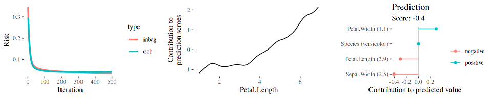

<!-- README.md is generated from README.Rmd. Please edit that file -->

# compboost: Fast and Flexible Component-Wise Boosting Framework <a href='https://danielschalk.com/compboost/'></a>

[](https://github.com/schalkdaniel/compboost/actions)
[](https://codecov.io/gh/schalkdaniel/compboost)
[](https://www.gnu.org/licenses/lgpl-3.0)
[](https://cran.r-project.org/package=compboost)
[](https://cran.r-project.org/package=compboost)
[](http://joss.theoj.org/papers/94cfdbbfdfc8796c5bdb1a74ee59fcda)

[Documentation](https://danielschalk.com/compboost/) |
[Contributors](CONTRIBUTORS.md) | [Release Notes](NEWS.md)

## Overview

Component-wise boosting applies the boosting framework to statistical
models, e.g., general additive models using component-wise smoothing
splines. Boosting these kinds of models maintains interpretability and
enables unbiased model selection in high dimensional feature spaces.

The `R` package `compboost` is an alternative implementation of
component-wise boosting written in `C++` to obtain high runtime
performance and full memory control. The main idea is to provide a
modular class system which can be extended without editing the source
code. Therefore, it is possible to use `R` functions as well as `C++`
functions for custom base-learners, losses, logging mechanisms or
stopping criteria.

For an introduction and overview about the functionality visit the
[project page](https://schalkdaniel.github.io/compboost/).

## Installation

#### CRAN version:

``` r
install.packages("compboost")
```

#### Developer version:

``` r
devtools::install_github("schalkdaniel/compboost")
```

## Examples

### Using the compboost API

The examples are rendered using <code>compboost 0.1.1</code>.

The fastest way to train a `Compboost` model is to use the wrapper
functions `boostLinear()` or `boostSplines()`:

``` r
cboost = boostSplines(data = iris, target = "Sepal.Length", loss = LossQuadratic$new(),
  oob_fraction = 0.3, iterations = 500L, trace = 100L)

gridExtra::grid.arrange(
  plotRisk(cboost),
  plotPEUni(cboost, "Petal.Length"),
  plotIndividualContribution(cboost, iris[70, ], offset = FALSE),
  ncol = 3L
)
```



For more extensive examples and how to use the `R6` interface visit the
[project
page](https://danielschalk.com/compboost/articles/getting_started/use_case.html).

### Tuning compboost using mlr3

For a convenient possibility to tune `compboost`, a
[`mlr3`](https://github.com/mlr-org/mlr3) learner is exported by this
package. Furthermore, the tuning can be easily done using the
[`mlr3tuningspaces`](https://github.com/mlr-org/mlr3tuningspaces)
package:

``` r
library(mlr3tuningspaces)

# tune learner with default search space
instance = tune(
  method = "random_search",
  task = tsk("sonar"),
  learner = lts(lrn("classif.compboost", predict_type = "prob")),
  resampling = rsmp("holdout"),
  measure = msr("classif.auc"),
  term_evals = 5
)

# best performing hyperparameter configuration
instance$result
#>    iterations learning_rate    df df_cat learner_param_vals  x_domain classif.auc
#> 1:       2875        0.2774 1.288    2.1          <list[4]> <list[4]>       0.739
```

## Benchmark

To get an idea of the performance of compboost, we have conduct a small
benchmark in which compboost is compared with mboost. For this purpose,
the runtime behavior and memory consumption of the two packages were
compared. The results of the benchmark can be read
[here](https://github.com/schalkdaniel/compboost/tree/master/benchmark).

## Citing

To cite `compboost` in publications, please use:

> Schalk et al., (2018). compboost: Modular Framework for Component-Wise
> Boosting. Journal of Open Source Software, 3(30), 967,
> <https://doi.org/10.21105/joss.00967>

    @article{schalk2018compboost,
      author = {Daniel Schalk, Janek Thomas, Bernd Bischl},
      title = {compboost: Modular Framework for Component-Wise Boosting},
      URL = {https://doi.org/10.21105/joss.00967},
      year = {2018},
      publisher = {Journal of Open Source Software},
      volume = {3},
      number = {30},
      pages = {967},
      journal = {JOSS}
    }

## Testing

### On your local machine

In order to test the pacakge functionality you can use devtools to test
the package on your local machine:

``` r
devtools::test()
```
