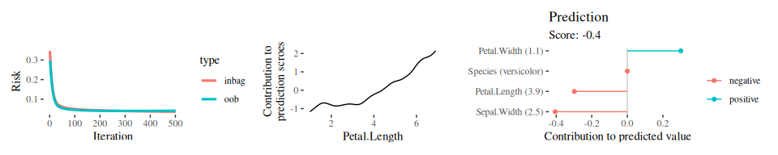

<!-- README.md is generated from README.Rmd. Please edit that file -->

# compboost: Fast and Flexible Component-Wise Boosting Framework <a href='https://danielschalk.com/compboost/'></a>

[](https://github.com/schalkdaniel/compboost/actions)
[](https://codecov.io/gh/schalkdaniel/compboost)
[](https://www.gnu.org/licenses/lgpl-3.0)
[](https://cran.r-project.org/package=compboost)
[](https://cran.r-project.org/package=compboost)
[](http://joss.theoj.org/papers/94cfdbbfdfc8796c5bdb1a74ee59fcda)

[Documentation](https://danielschalk.com/compboost/) \|
[Contributors](CONTRIBUTORS.md) \| [Release Notes](NEWS.md)

## Overview

Component-wise boosting applies the boosting framework to statistical
models, e.g., general additive models using component-wise smoothing
splines. Boosting these kinds of models maintains interpretability and
enables unbiased model selection in high dimensional feature spaces.

The `R` package `compboost` is an alternative implementation of
component-wise boosting written in `C++` to obtain high runtime
performance and full memory control. The main idea is to provide a
modular class system which can be extended without editing the source
code. Therefore, it is possible to use `R` functions as well as `C++`
functions for custom base-learners, losses, logging mechanisms or
stopping criteria.

For an introduction and overview about the functionality visit the
[project page](https://schalkdaniel.github.io/compboost/).

## Installation

#### CRAN version:

``` r
install.packages("compboost")
```

#### Developer version:

``` r
devtools::install_github("schalkdaniel/compboost")
```

## Examples

The examples are rendered using <code>compboost 0.1.2</code>.

The fastest way to train a `Compboost` model is to use the wrapper
functions `boostLinear()` or `boostSplines()`:

``` r
cboost = boostSplines(data = iris, target = "Sepal.Length",
  oob_fraction = 0.3, iterations = 500L, trace = 100L)

ggrisk = plotRisk(cboost)
ggpe = plotPEUni(cboost, "Petal.Length")
ggicont =  plotIndividualContribution(cboost, iris[70, ], offset = FALSE)

library(patchwork)

ggrisk + ggpe + ggicont
```



For more extensive examples and how to use the `R6` interface visit the
[project
page](https://danielschalk.com/compboost/articles/getting_started/use_case.html).

## mlr learner

Compboost also ships an [`mlr3`](https://mlr3.mlr-org.com/) learners for
regression and binary classification which can be used to apply
`compboost` within the whole [`mlr3verse`](https://mlr3.mlr-org.com/):

``` r
ts = tsk("spam")
lcboost = lrn("classif.compboost", iterations = 500L, bin_root = 2)
lcboost$train(ts)
lcboost$predict_type = "prob"
lcboost$predict(ts)
#> <PredictionClassif> for 4601 observations:
#>     row_ids   truth response prob.spam prob.nonspam
#>           1    spam     spam 0.5541776    0.4458224
#>           2    spam     spam 0.8637144    0.1362856
#>           3    spam     spam 0.8242054    0.1757946
#> ---                                                
#>        4599 nonspam  nonspam 0.2052921    0.7947079
#>        4600 nonspam  nonspam 0.2326375    0.7673625
#>        4601 nonspam  nonspam 0.2624331    0.7375669

# Access the `$model` field to access all the `compboost` functionality:
plotBaselearnerTraces(lcboost$model) +
  plotPEUni(lcboost$model, "charDollar")
```

<!-- -->

## Save and load models

Because of the usage of `C++` objects as backend, it is not possible to
use `R`s `save()` method to save models. Instead, use
`$saveToJson("mymodel.json")` to save the model to `mymodel.json` and
`Compboost$new(file = "mymodel.json")` to load the model:

``` r
cboost = boostSplines(iris, "Sepal.Width")
cboost$saveToJson("mymodel.json")

cboost_new = Compboost$new(file = "mymodel.json")

# Save the model without data:
cboost$saveToJson("mymodel_without_data.json", rm_data = TRUE)
```

## Benchmark

- A small benchmark was conducted to compare `compboost` with
  [`mboost`](https://cran.r-project.org/web/packages/mboost/index.html).
  For this purpose, the runtime behavior and memory consumption of the
  two packages were compared. The results of the benchmark can be read
  [here](https://github.com/schalkdaniel/compboost/tree/master/benchmark).
- A bigger benchmark with adaptions to increase the runtime and memory
  efficiency can be found
  [here](https://doi.org/10.1080/10618600.2022.2116446).

## Citing

To cite `compboost` in publications, please use:

> Schalk et al., (2018). compboost: Modular Framework for Component-Wise
> Boosting. Journal of Open Source Software, 3(30), 967,
> <https://doi.org/10.21105/joss.00967>

    @article{schalk2018compboost,
      author = {Daniel Schalk, Janek Thomas, Bernd Bischl},
      title = {compboost: Modular Framework for Component-Wise Boosting},
      URL = {https://doi.org/10.21105/joss.00967},
      year = {2018},
      publisher = {Journal of Open Source Software},
      volume = {3},
      number = {30},
      pages = {967},
      journal = {JOSS}
    }

## Testing

### On your local machine

In order to test the package functionality you can use devtools to test
the package on your local machine:

``` r
devtools::test()
```
