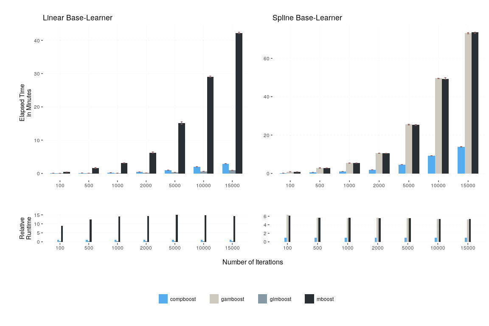
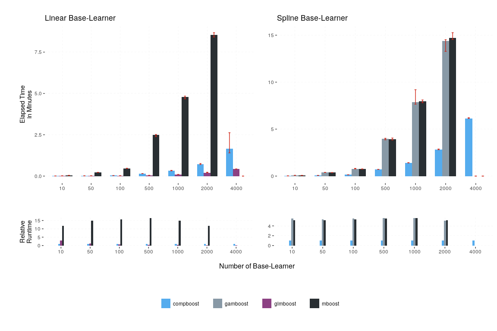
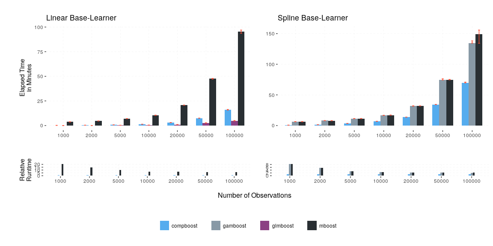
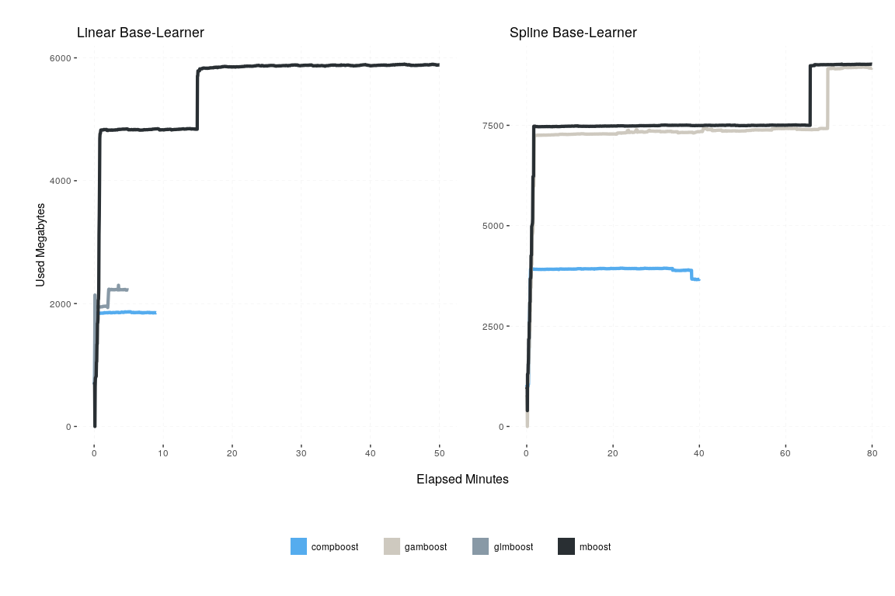

# Benchmarking compboost vs. mboost

This benchmark was executed on a `Linux` machine with a `Intel(R)
Xeon(R) CPU E5-2650 v2 @ 2.60GHz 62GiB System` using the `R` package
`batchtools`.

This document was automatically created using `drake`. To recreate this
document just source `drake_benchmark.R`.

## Runtime Benchmark

As already mentioned, the benchmark was conducted using `batchtools`. In
case of benchmarking the runtime, we executed each algorithm for each
configuration five times. The height of the bars of the following plots
corresponds to the median of these five evaluations. The drawn error-bar
illustrates the maximal and minimal measured runtime.

Since we are interested in tracking the performance while varying three
different parameter we vary one and fix the others at a specific value.
The three interesting parameters are the number of iterations, number of
observations, and number of features. To run the benchmark on your own
machine it is sufficient to execute the `execute_runtime_benchmark.R`
script and submit the jobs by calling `submitJobs()`. For the benchmark
we have just used one due to a very high memory allocation of some jobs
crashes the system on multiple processes.

To access the raw results you need to load the registry:

``` r
loadRegistry("benchmark/runtime/benchmark_files")
```

After preprocessing the raw data are stored into a `data.frame` where
each row represents a job with instances like the elapsed time and the
dimension of the simulated data:

| job.id |    time | learner | iters | algo      | nrows | ncols |
| -----: | ------: | :------ | ----: | :-------- | ----: | ----: |
|    144 |  0.8205 | spline  |   100 | gamboost  |  2000 |  1001 |
|    457 | 10.6092 | linear  |  1500 | mboost    | 10000 |  1001 |
|    255 |  1.4300 | spline  |  1500 | compboost |  2000 |  1001 |
|    492 |  0.0848 | spline  |  1500 | gamboost  |  2000 |    11 |
|    502 |  0.3844 | spline  |  1500 | gamboost  |  2000 |    51 |
|    111 |  1.5987 | linear  |   500 | mboost    |  2000 |  1001 |
|    109 |  0.3911 | linear  |   100 | mboost    |  2000 |  1001 |
|    253 |  1.4084 | spline  |  1500 | compboost |  2000 |  1001 |
|    162 | 25.2750 | spline  |  5000 | gamboost  |  2000 |  1001 |
|    225 |  0.0733 | spline  |  1500 | compboost |  2000 |    51 |

The preprocessing is defined in the `drake_runtime_benchmark.R` script
where `raw.runtime.benchmark.data` is created. This also applies to the
following graphics.

For any of the following bars with a height of zero it was not possible
to execute the algorithm with the corresponding specification.

### Increasing Number of Iterations

While increasing the number of iterations we fixed the number of
observations at 2000, and the number of feature at 1000. Under this
configuration we achieve a 15 times faster fitting process with
`compboost` compared to `mboost` in boosting linear base-learner.
Nevertheless, `glmboost` is faster due to the internal structure of
`glmboost`, which is due to that all base-learners can be fitted in one
matrix multiplication. But this approach is not suitable for `compboost`
since it does not fit into the object-oriented system we provide. This
is due to the flexibility in specifying ordinary base-learner
combination and not making the whole fitting process conditionally on
the used base-learners. Nevertheless, using spline base-learner,
`compboost` is about five times faster than `mboost` and `glmboost`
(which is just a wrapper of the original `mboost`
algorithm).



Note that the relative factor highly depends on the number of
observations. This behavior is described above.

### Increasing Number of Base-Learner

For increasing the number of base-learners we get a equal behavior as
for increasing the number of iterations. Nevertheless, with `mboost` it
was not able to conduct the boosting on 4000 features while `compboost`
it was. For this experiments we fix the number of observations at 2000
and the number of iterations at
1500.



### Increasing Number of Observations

This may have the biggest effect on computation time since increasing
the number of observations affects the allocated memory as well as the
size of the internal matrix multiplications.

For a smaller number of observations, `compboost` definitely outperforms
`mboost`. The relative runtime behavior decreases with increasing the
number of observations. This is due to the size of the matrix
multiplications which gets more weight then the whole boiler code, like
initializing base-learner, which is very fast with `compboost`. For that
reason and the reason that matrix multiplication is also not that slow
in `R`, `mboost` comes closer to the performance of
`compboost`.



## Memory Benchmark

For the memory benchmark every second was measured how much RAM was
used. This curve is then plotted for each algorithm.

In the case of the spline base-learner, `compboost` and `mboost` uses
sparse matrices, which significantly reduces computing time and memory
requirements. In general, `compboost` is efficient here too. A small
exception is `glmboost`, which can also save memory due to its special
structure.


