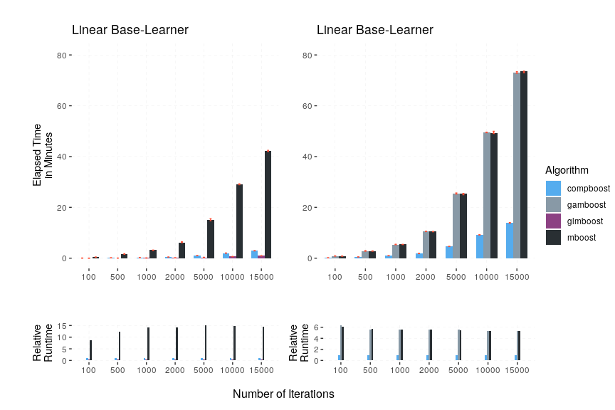
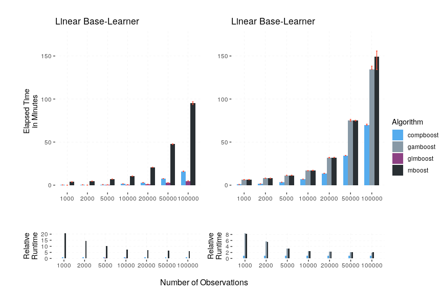

# Benchmarking compboost vs. mboost

This benchmark was executed on a `Linux` machinewith a `Intel(R) Xeon(R)
CPU E5-2650 v2 @ 2.60GHz 62GiB System` using the `R` package
`batchtools`.

This document was automatically created using `drake`. To recreate this
document just source `drake_runtime_benchmark.R`.

## Runtime Benchmark

To access the raw results of the runtime benchmark you need to load the
registry:

After preprocessing the raw data are stored into a `data.frame` where
each row represents a job with instances like the elapsed time and the
dimension of the simulated data:

<table>

<thead>

<tr>

<th style="text-align:left;">

</th>

<th style="text-align:right;">

job.id

</th>

<th style="text-align:right;">

time

</th>

<th style="text-align:left;">

learner

</th>

<th style="text-align:right;">

iters

</th>

<th style="text-align:left;">

algo

</th>

<th style="text-align:right;">

nrows

</th>

<th style="text-align:right;">

ncols

</th>

</tr>

</thead>

<tbody>

<tr>

<td style="text-align:left;">

144

</td>

<td style="text-align:right;">

144

</td>

<td style="text-align:right;">

0.8205

</td>

<td style="text-align:left;">

spline

</td>

<td style="text-align:right;">

100

</td>

<td style="text-align:left;">

gamboost

</td>

<td style="text-align:right;">

2000

</td>

<td style="text-align:right;">

1001

</td>

</tr>

<tr>

<td style="text-align:left;">

457

</td>

<td style="text-align:right;">

457

</td>

<td style="text-align:right;">

10.6092

</td>

<td style="text-align:left;">

linear

</td>

<td style="text-align:right;">

1500

</td>

<td style="text-align:left;">

mboost

</td>

<td style="text-align:right;">

10000

</td>

<td style="text-align:right;">

1001

</td>

</tr>

<tr>

<td style="text-align:left;">

255

</td>

<td style="text-align:right;">

255

</td>

<td style="text-align:right;">

1.4300

</td>

<td style="text-align:left;">

spline

</td>

<td style="text-align:right;">

1500

</td>

<td style="text-align:left;">

compboost

</td>

<td style="text-align:right;">

2000

</td>

<td style="text-align:right;">

1001

</td>

</tr>

<tr>

<td style="text-align:left;">

492

</td>

<td style="text-align:right;">

492

</td>

<td style="text-align:right;">

0.0848

</td>

<td style="text-align:left;">

spline

</td>

<td style="text-align:right;">

1500

</td>

<td style="text-align:left;">

gamboost

</td>

<td style="text-align:right;">

2000

</td>

<td style="text-align:right;">

11

</td>

</tr>

<tr>

<td style="text-align:left;">

502

</td>

<td style="text-align:right;">

502

</td>

<td style="text-align:right;">

0.3844

</td>

<td style="text-align:left;">

spline

</td>

<td style="text-align:right;">

1500

</td>

<td style="text-align:left;">

gamboost

</td>

<td style="text-align:right;">

2000

</td>

<td style="text-align:right;">

51

</td>

</tr>

<tr>

<td style="text-align:left;">

111

</td>

<td style="text-align:right;">

111

</td>

<td style="text-align:right;">

1.5987

</td>

<td style="text-align:left;">

linear

</td>

<td style="text-align:right;">

500

</td>

<td style="text-align:left;">

mboost

</td>

<td style="text-align:right;">

2000

</td>

<td style="text-align:right;">

1001

</td>

</tr>

<tr>

<td style="text-align:left;">

109

</td>

<td style="text-align:right;">

109

</td>

<td style="text-align:right;">

0.3911

</td>

<td style="text-align:left;">

linear

</td>

<td style="text-align:right;">

100

</td>

<td style="text-align:left;">

mboost

</td>

<td style="text-align:right;">

2000

</td>

<td style="text-align:right;">

1001

</td>

</tr>

<tr>

<td style="text-align:left;">

253

</td>

<td style="text-align:right;">

253

</td>

<td style="text-align:right;">

1.4084

</td>

<td style="text-align:left;">

spline

</td>

<td style="text-align:right;">

1500

</td>

<td style="text-align:left;">

compboost

</td>

<td style="text-align:right;">

2000

</td>

<td style="text-align:right;">

1001

</td>

</tr>

<tr>

<td style="text-align:left;">

162

</td>

<td style="text-align:right;">

162

</td>

<td style="text-align:right;">

25.2750

</td>

<td style="text-align:left;">

spline

</td>

<td style="text-align:right;">

5000

</td>

<td style="text-align:left;">

gamboost

</td>

<td style="text-align:right;">

2000

</td>

<td style="text-align:right;">

1001

</td>

</tr>

<tr>

<td style="text-align:left;">

225

</td>

<td style="text-align:right;">

225

</td>

<td style="text-align:right;">

0.0733

</td>

<td style="text-align:left;">

spline

</td>

<td style="text-align:right;">

1500

</td>

<td style="text-align:left;">

compboost

</td>

<td style="text-align:right;">

2000

</td>

<td style="text-align:right;">

51

</td>

</tr>

<tr>

<td style="text-align:left;">

506

</td>

<td style="text-align:right;">

506

</td>

<td style="text-align:right;">

0.0176

</td>

<td style="text-align:left;">

linear

</td>

<td style="text-align:right;">

1500

</td>

<td style="text-align:left;">

glmboost

</td>

<td style="text-align:right;">

2000

</td>

<td style="text-align:right;">

51

</td>

</tr>

<tr>

<td style="text-align:left;">

147

</td>

<td style="text-align:right;">

147

</td>

<td style="text-align:right;">

2.8173

</td>

<td style="text-align:left;">

spline

</td>

<td style="text-align:right;">

500

</td>

<td style="text-align:left;">

gamboost

</td>

<td style="text-align:right;">

2000

</td>

<td style="text-align:right;">

1001

</td>

</tr>

<tr>

<td style="text-align:left;">

581

</td>

<td style="text-align:right;">

581

</td>

<td style="text-align:right;">

11.2824

</td>

<td style="text-align:left;">

spline

</td>

<td style="text-align:right;">

1500

</td>

<td style="text-align:left;">

gamboost

</td>

<td style="text-align:right;">

5000

</td>

<td style="text-align:right;">

1001

</td>

</tr>

<tr>

<td style="text-align:left;">

153

</td>

<td style="text-align:right;">

153

</td>

<td style="text-align:right;">

5.3231

</td>

<td style="text-align:left;">

spline

</td>

<td style="text-align:right;">

1000

</td>

<td style="text-align:left;">

gamboost

</td>

<td style="text-align:right;">

2000

</td>

<td style="text-align:right;">

1001

</td>

</tr>

<tr>

<td style="text-align:left;">

26

</td>

<td style="text-align:right;">

26

</td>

<td style="text-align:right;">

9.2119

</td>

<td style="text-align:left;">

spline

</td>

<td style="text-align:right;">

10000

</td>

<td style="text-align:left;">

compboost

</td>

<td style="text-align:right;">

2000

</td>

<td style="text-align:right;">

1001

</td>

</tr>

</tbody>

</table>

The preprocessing can be reproduced by taking a look at how
`raw.runtime.benchmark.data` was created within the
`drake_runtime_benchmark.R` script. This also applies for the following
graphics.

### Increasing Number of Iterations

## Increasing Number of Base-Learner

## Increasing Number of Observations

### Memory Benchmark
