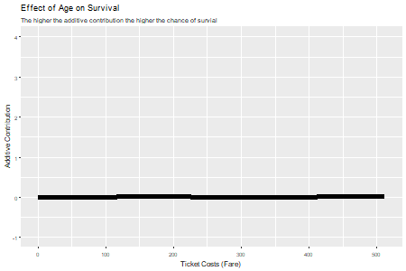

```{r, include=FALSE}
knitr::opts_chunk$set(collapse = TRUE)
# devtools::load_all()
library(compboost)
```


<hr>

`compboost` was designed to provide a component-wise boosting framework with
maximal flexibility. This document gives an introduction to the classes that 
must be set and how to access the data which are generated during the fitting
process. In this document we are using the `C++` looking API which was 
generated using @eddelbuettel2017exposing
[Rcpp modules](https://cran.r-project.org/web/packages/Rcpp/vignettes/Rcpp-modules.pdf).
We will have a look at:

- Define the data and factory (baselearner generators) objects.
- Define the used loss and optimizer for modelling.
- Define different logger for tracking the algorithm.
- Run the algorithm and access the fitted values.
- Continue training of the algorithm and set the algorithm to a specific 
  iteration.

To get a deeper understanding about the functionality and how the classes are 
related see the [C++ documentation of the package](https://schalkdaniel.github.io/compboost/cpp_man/html/index.html).


## Data: Titanic Passenger Survival Data Set

We use the [titanic dataset](https://www.kaggle.com/c/titanic/data) with binary
classification on `survived`. First of all we store the train and test data
in two data frames and prevent compboost from crashing by removing all rows
containing `NA`s:

```{r}
# Store train and test data:
df.train = na.omit(titanic::titanic_train)
df.test  = na.omit(titanic::titanic_test)

str(df.train)
```

In the next step we transform the response to values $y \in \{-1, 1\}$ and do 
another split on the training dataset:
 
```{r}
# Response label have to be in {-1, 1}:
response = df.train$Survived * 2 - 1

# Train and evaluation split for training:
set.seed(1111)

idx.train = sample(x = seq_len(nrow(df.train)), size = 0.6 * nrow(df.train))
idx.eval  = setdiff(seq_len(nrow(df.train)), idx.train) 
```

This split will be used while the training to calculate the out of bag risk. 


## Data and Factories

The data classes can just handle matrices. Hence, the user is responsible
for giving an appropriate data matrix to a specific baselearner. For instance
the spline baselearner/factory can just handle a matrix with one column while 
the polynomial baselearner/factory can handle arbitrary matrices. A linear 
baselearner with intercept can be achieved by giving a matrix with an intercept
column which contains just ones and an ordinary data column.

In compboost the factories accept two data object as arguments. The first one
is the data source and the second one the data target (which should be an
empty data object). The factory then does the following:

1. Takes the data of the data source object.
2. Transform the data depending on the baselearner (e.g. compute spline bases).
3. Write the design matrix and other permanent data into the data target object.

### Numerical Feature

We now want to include the ticket price `Fare` and the age of the passenger 
`Age` by using spline baselearner. 

```{r}
# Fare:
# --------

# Define data source:
data.source.fare = InMemoryData$new(as.matrix(df.train$Fare[idx.train]), "Fare")
# Define data target:
data.target.fare = InMemoryData$new()
# Define spline factory:
spline.factory.fare = PSplineBlearnerFactory$new(data_source = data.source.fare, 
  data_target = data.target.fare, degree = 3, n_knots = 20, penalty = 10, 
  differences = 2)


# Age:
# --------

# Define data source:
data.source.age = InMemoryData$new(as.matrix(df.train$Age[idx.train]), "Age")
# Define data target:
data.target.age = InMemoryData$new()
# Define spline factory:
spline.factory.age = PSplineBlearnerFactory$new(data_source = data.source.age, 
  data_target = data.target.age, degree = 3, n_knots = 20, penalty = 10, 
  differences = 2)
```


Remember the workflow of the factory which takes the data source, transform the
data and write it into the target. We can access the transformed data of the
target by calling the member function `getData()`:
```{r}
data.target.fare$getData()[1:10, 1:5]
```

We also want to have out of bag information while fitting the algorithm. 
Therefore, we have to define another data object containing the data source of
the evaluation data:
```{r}
# Define evaluation data objects:
data.eval.fare = InMemoryData$new(as.matrix(df.train$Fare[idx.eval]), "Fare")
data.eval.age  = InMemoryData$new(as.matrix(df.train$Age[idx.eval]), "Age")
```


### Categorial Feature

Since there isn't an automated transformation of categorical data to an 
appropriate matrix yet, we have to handle categorical features manually. 
Therefore we are just using the two feature
`sex` and `Pclass`:
```{r}
table(df.train$Sex)
table(df.train$Pclass)
```

In component-wise boosting we use one hot encoding (dummy encoding) and give
each binary vector as one source data matrix. This is done for every category
of the vector. As baselearner we use a linear baselearner to estimate group 
specific means. The advantage of using every group as own baselearner is the
possibility, that just important groups are selected. It is not necessary to 
update all parameters (means) of the categorical feature simultaneously. This 
procedure also reduces the bias of the model selection which is done inherent
in component-wise boosting see [@hofner2011framework].

The problem now is, that we have to define a data source and target for every
group within the categorical features. To avoid copy and pasting we use a for
loop to dynamically store the object into a list. Note that the `S4` setting
makes it more difficult to assign objects to a list. Therefore we assign an 
empty list before creating and storing the `S4` object:

```{r}
# Gender:
# --------

# Unique groups:
classes.sex = unique(df.train$Sex)

# Frame for the data and factory:
data.sex.list = list()

data.sex.list[["source"]]  = list()
data.sex.list[["target"]]  = list()
data.sex.list[["test"]]    = list()
data.sex.list[["factory"]] = list()

for (class in classes.sex) {
  
  # Create dummy variable and feature name:
  class.temp = ifelse(df.train$Pclass == class, 1, 0)
  data.name  = paste0("Sex.", class)
  
  # Define data source:
  data.sex.list[["source"]][[data.name]] = list()
  data.sex.list[["source"]][[data.name]] = InMemoryData$new(
    as.matrix(class.temp[idx.train]), # data
    data.name # data identifier
  )
  # Define data target:
  data.sex.list[["target"]][[data.name]] = list()
  data.sex.list[["target"]][[data.name]] = InMemoryData$new()
  
  # Define oob data for logging:
  data.sex.list[["test"]][[data.name]] = list()
  data.sex.list[["test"]][[data.name]] = InMemoryData$new(
    as.matrix(class.temp[idx.eval]), #data
    data.name # data identifier
  )
  
  # Define Factory object:
  data.sex.list[["factory"]][[data.name]] = list()
  data.sex.list[["factory"]][[data.name]] = PolynomialBlearnerFactory$new(
    data_source = data.sex.list[["source"]][[data.name]],
    data_target = data.sex.list[["target"]][[data.name]],
    degree      = 1
  )
}

# Passenger Class:
# -------------------

# Unique groups:
classes.pclass = unique(df.train$Pclass)

# Frame for the data and factory:
data.pclass.list = list()

data.pclass.list[["source"]]  = list()
data.pclass.list[["target"]]  = list()
data.pclass.list[["test"]]    = list()
data.pclass.list[["factory"]] = list()

for (class in classes.pclass) {
  
  # Create dummy variable and feature name:
  class.temp = ifelse(df.train$Pclass == class, 1, 0)
  data.name  = paste0("Pclass.", class)
  
  # Define data source:
  data.pclass.list[["source"]][[data.name]] = list()
  data.pclass.list[["source"]][[data.name]] = InMemoryData$new(
    as.matrix(class.temp[idx.train]), # data
    data.name # data identifier
  )
  # Define data target:
  data.pclass.list[["target"]][[data.name]] = list()
  data.pclass.list[["target"]][[data.name]] = InMemoryData$new()
  
  # Define oob data for logging:
  data.pclass.list[["test"]][[data.name]] = list()
  data.pclass.list[["test"]][[data.name]] = InMemoryData$new(
    as.matrix(class.temp[idx.eval]), # data
    data.name # data identifier
  )
  
  # Define Factory object:
  data.pclass.list[["factory"]][[data.name]] = list()
  data.pclass.list[["factory"]][[data.name]] = PolynomialBlearnerFactory$new(
    data_source = data.pclass.list[["source"]][[data.name]],
    data_target = data.pclass.list[["target"]][[data.name]],
    degree      = 1
  )
}
```

Finally we need to register all the baselearner factories we want to use for
modelling:
```{r}
# Create new factory list:
factory.list = BlearnerFactoryList$new()

# Numeric factories:
factory.list$registerFactory(spline.factory.fare)
factory.list$registerFactory(spline.factory.age)

# Categorial features:
for (lst in data.sex.list[["factory"]]) {
  factory.list$registerFactory(lst)
}
for (lst in data.pclass.list[["factory"]]) {
  factory.list$registerFactory(lst)
}

# Print registered factories:
factory.list
```


## Loss and Optimizer

Since we are interested in binary classification we can use the binomial 
loss. This loss is used while training and determines the pseudo residuals as 
well as the empirical risk which we want to minimize:
```{r}
loss.bin = BinomialLoss$new()
loss.bin
```

Since we are in the boosting context the classical way of selecting the best
baselearner within one iteration by using the greedy optimizer:
```{r}
used.optimizer = GreedyOptimizer$new()
```

## Define Logger

As mentioned above, we have to define every element of the algorithm by
ourselves. This also includes the logger which also acts as stopper. That means, 
that we have to define the logger and if that logger should also be used
as stopper. 

### Iterations logger

This logger just logs the current iteration and stops if `max_iterations` is 
reached. In our case we want to stop after 2500 iterations:

```{r}
log.iterations = IterationLogger$new(use_as_stopper = TRUE, max_iterations = 2500)
```

Note that the arguments as `max_iterations` are just used if we define the
logger also as stopper. Otherwise the arguments are ignored.

### Time logger

This logger logs the elapsed time. The time unit can be one of `microseconds`,
`seconds` or `minutes`. The logger stops if `max_time` is reached:

```{r}
log.time = TimeLogger$new(use_as_topper = FALSE, max_time = 120, 
  time_unit = "seconds")
```

### Inbag risk logger

This logger logs the inbag risk by calculating the empirical risk using the
training data. Note that it is necessary to specify a loss which is used
to calculate the empirical risk. In the most common situation we use the the
same loss as used for training to display the progress of the fitting:

```{r}
log.inbag = InbagRiskLogger$new(use_as_stopper = FALSE, used_loss = loss.bin,
  eps_for_break = 0.05)
```


### Out of bag risk logger

The out of bag risk logger does basically the same as the inbag risk logger but
calculates the empirical risk using another data source. Therefore, the new data
object have to be a list with data sources containing the evaluation data:

```{r}
# List with out of bag data sources:
oob.list = list()

# Numeric featurs:
oob.list[[1]] = data.eval.fare
oob.list[[2]] = data.eval.age

# Categorial features:
for (lst in data.sex.list[["test"]]) {
  oob.list = c(oob.list, lst)
}
for (lst in data.pclass.list[["test"]]) {
  oob.list = c(oob.list, lst)
}
```

Finally we create the out of bag risk object by also specifying the 
corresponding `y` labels:

```{r}
log.oob = OobRiskLogger$new(use_as_stopper = FALSE, used_loss = loss.bin,
  eps_for_break = 0.05, oob_data = oob.list, oob_response = response[idx.eval])
```

### Custom AUC logger

The risk logger in combination with a custom loss can also be used to log 
performance measures. We illustrate this procedure using the `AUC` measure from
[mlr](https://mlr-org.github.io/mlr-tutorial/release/html/index.html):

```{r}
# Define custom "loss function"
aucLoss = function (truth, response) {
  # Convert response on f basis to probs using sigmoid:
  probs = 1 / (1 + exp(-response))
  
  #  Calculate AUC:
  mlr:::measureAUC(probabilities = probs, truth = truth, negative = -1, positive = 1) 
}

# Define also gradient and constant initalization since they are necessary for
# the custom loss:
gradDummy = function (trutz, response) { return (NA) }
constInitDummy = function (truth, response) { return (NA) }

# Define loss:
auc.loss = CustomLoss$new(aucLoss, gradDummy, constInitDummy)
```

Now we can create a new inbag and out of bag logger to log the AUC while 
fitting the model:
```{r}
log.inbag.auc = InbagRiskLogger$new(use_as_stopper = FALSE, used_loss = auc.loss,
  eps_for_break = 0.05)
log.oob.auc   = OobRiskLogger$new(use_as_stopper = FALSE, used_loss = auc.loss,
  eps_for_break = 0.05, oob_data = oob.list, oob_response = response[idx.eval])
```


This procedure can be used for any other risk measure. For a detailed 
description on how to extending compboost with custom losses or baselearner 
see the [extending compboost vignette]().


### Create logger list and register logger

Finally, we need to define a logger list object and register all the logger we
want to track:
```{r}
# Define new logger list:
logger.list = LoggerList$new()

# Register logger:
logger.list$registerLogger(" iteration.logger", log.iterations)
logger.list$registerLogger("time.logger", log.time)
logger.list$registerLogger("inbag.binomial", log.inbag)
logger.list$registerLogger("oob.binomial", log.oob)
logger.list$registerLogger("inbag.auc", log.inbag.auc)
logger.list$registerLogger("oob.auc", log.oob.auc)

logger.list
```


## Train Model and Access Elements

Now after defining all object which are required by `compboost` we can define
the `compboost` object with a learning rate of `0.05` and stopper rule that 
the algorithm should stop when the first stopper is fulfilled:

```{r}
# Initialize object:
cboost = Compboost$new(
  response      = response[idx.train],
  learning_rate = 0.05,
  stop_if_all_stopper_fulfilled = FALSE,
  factory_list = factory.list,
  loss         = loss.bin,
  logger_list  = logger.list,
  optimizer    = used.optimizer
)

# Train the model (we want to print the trace):
cboost$train(trace = FALSE)
```

### Accessing Elements

To get the fitted parameters we can use the `getEstimatedParameter()` function:
```{r}
params = cboost$getEstimatedParameter()
str(params)
```

It is also possible to get the trace how the baselearner are fitted by calling
`getSelectedBaselearner()`
```{r}
blearner.trace = cboost$getSelectedBaselearner()
table(blearner.trace)
blearner.trace[1:10]
```

### ROC curve

We want to predict new labels for the out of bag data:
```{r}
# Get predicted scores and probability (with sigmoid):
scores      = cboost$predict(oob.list)
prob.scores = 1 / (1 + exp(-scores))

# Calculate labels with threshold of 0.5:
pred.labels = ifelse(prob.scores > 0.5, 1, -1)

# Calculate confusion matrix:
table(pred = pred.labels, truth = response[idx.eval])
```

Looking at the confusion matrix we have a good sensitivity but bad false 
positive rate. Therefore it would be more informative to take a look at the AUC
and the ROC curve. To compute the AUC and the ROC curve we can proceed as
follows:

```{r, warning=FALSE, fig.align="center", fig.width=7, fig.height=4.6, out.width="600px",out.height="400px"}
library(ggplot2)

# True labels as binary vector (0, 1):
labels = (response[idx.eval] + 1) / 2
labels = labels[order(scores, decreasing = TRUE)]
myroc = data.frame(
  TPR = cumsum(labels)/sum(labels), 
  FPR = cumsum(!labels)/sum(!labels), 
  Labels = labels
)

# AUC:
mlr::measureAUC(probabilities = prob.scores, truth = response[idx.eval], 
  negative = -1, positive = 1)

ggplot(data = myroc, aes(x = FPR, y = TPR)) +
  geom_abline(intercept = 0, slope = 1) +
  geom_line(size = 2) +
  ggtitle("ROC Curve")
```

## Continue and Reposition the Training

The fastest way to continuing the training is to use the `setToIteration()`
function. If we set the algorithm to an iteration bigger than the actual
maximal iteration, then `compboost` automatically trains the remaining 
baselearner:
```{r}
cboost$setToIteration(k = 3000)
cboost
```

The drawback of using `setToIteration()` is, that the function doesn't 
continuing logging. The logger data for the second training (from iteration
501 to 1000) is then just a vector of the iterations.

Additionally, it is possible to continuing the training using the 
`continueTraining()` function. This function takes a boolian to indicate if the
trace should be printed and another logger list to get more control about the 
retraining. For instance, we can continuing the training for 3 seconds and see
how far we get. We also want to reuse the out of bag logger:
```{r}
# Define new time logger:
new.time.logger = TimeLogger$new(use_as_stopper = TRUE, max_time = 3,
  time_unit = "seconds")

# Define new logger list and register logger:
new.logger.list = LoggerList$new()

# Define new oob logger to prevent old logger data from overwriting:
new.oob.log     = OobRiskLogger$new(use_as_stopper = FALSE, used_loss = loss.bin,
  eps_for_break = 0.05, oob_data = oob.list, oob_response = response[idx.eval])
new.oob.auc.log = OobRiskLogger$new(use_as_stopper = FALSE, used_loss = auc.loss,
  eps_for_break = 0.05, oob_data = oob.list, oob_response = response[idx.eval])

new.logger.list$registerLogger("time", new.time.logger)
new.logger.list$registerLogger("oob.binomial", new.oob.log)
new.logger.list$registerLogger("oob.auc", new.oob.auc.log)

# Continue training:
cboost$continueTraining(trace = FALSE, logger_list = new.logger.list)
cboost
```

Note: With `setToIteration()` it is also possible to set `compboost` to an 
iteration smaller than the already trained ones. This becomes handy if one 
would like set the algorithm to an iteration corresponding to the minimum 
of the out of bag risk.

## Illustrating some Results

### Inbag vs OOB 

To compare the inbag and the out of bag AUC we first have to get the logger 
data:
```{r}
cboost.log = cboost$getLoggerData()
str(cboost.log)
```

This list contains all the data collected while training and retraining. 
Therefore, three list elements. We are interested in the first one:
```{r}
cboost.log = cboost.log[[1]]
str(cboost.log)
```

Next we create a data frame which we use for plotting:
```{r, message=FALSE, warning=FALSE, fig.align="center", fig.width=12, fig.height=4, out.width="700px",out.height="233px"}
auc.data = data.frame(
  iteration = rep(seq_len(nrow(cboost.log$logger.data)), 2),
  risk.type = rep(c("Inbag", "OOB"), each = nrow(cboost.log$logger.data)),
  AUC       = c(cboost.log$logger.data[, 2], cboost.log$logger.data[, 4]),
  emp.risk  = c(cboost.log$logger.data[, 3], cboost.log$logger.data[, 5])
)

p1 = ggplot(data = auc.data, aes(x = iteration, y = AUC, colour = risk.type)) +
  geom_line(size = 2) +
  ggtitle("AUC per Iteration")

p2 = ggplot(data = auc.data, aes(x = iteration, y = emp.risk, colour = risk.type)) +
  geom_line(size = 2) +
  ggtitle("Empirical Risk per Iteration")

gridExtra::grid.arrange(p1, p2, ncol = 2)
```

A surprising behavior is the AUC lines. We would expect the out of bag AUC
lower than the inbag AUC which isn't the case here. If we leave that out the
curves shows the usual behavior. The out of bag curve for the AUC raises till 
approximately 1200 iterations and then decrease. On the other hand, the out of 
bag risk also falls till approximately 1200 and then starts to increase. This
are clear signs that for more than 1200 iterations the algorithm starts to
overfit. We should think about using the model at the 1200th iteration.

### Fare Spline Baselearner

One of the key advantages of component-wise boosting is to have an interpretable
model. For instance it is now possible to illustrate the effect of fare. 
Therefore, we can use the `transformData()` function of the 
`spline.factory.fare` object to create the spline basis for new observations:
```{r, message=FALSE, warning=FALSE, fig.align="center", fig.width=7, fig.height=4.6, out.width="600px",out.height="400px"}
params = cboost$getEstimatedParameter()
params.fare = params$`Fare: spline with degree 3`

x.fare  = seq(from = min(df.train$Fare), to = max(df.train$Fare), length.out = 100)
x.basis = spline.factory.fare$transformData(as.matrix(x.fare))
x.response = x.basis %*% params.fare

plot.data = data.frame(x = x.fare, y = as.numeric(x.response))

ggplot(data = plot.data, aes(x = x, y = y)) +
  geom_line(size = 2) +
  xlab("Ticket Costs (Fare)") +
  ylab("Additive Contribution") +
  labs(title="Effect of Age on Survival", 
       subtitle="The higher the additive contribution the higher the chance of survial")
```

We recognize, that this curve results from taking the parameter after 
`r length(cboost$getSelectedBaselearner())` iterations. That could be way too 
much and could tend to overfitting. Because of the out of bag behavior, we set 
the iteration to 1200:

```{r, message=FALSE, warning=FALSE, fig.align="center", fig.width=7, fig.height=4.6, out.width="600px",out.height="400px"}
cboost$setToIteration(k = 1200)

params = cboost$getEstimatedParameter()
params.fare = params$`Fare: spline with degree 3`

x.fare  = seq(from = min(df.train$Fare), to = max(df.train$Fare), length.out = 100)
x.basis = spline.factory.fare$transformData(as.matrix(x.fare))
x.response = x.basis %*% params.fare

plot.data = data.frame(x = x.fare, y = as.numeric(x.response))

ggplot(data = plot.data, aes(x = x, y = y)) +
  geom_line(size = 2) +
  xlab("Ticket Costs (Fare)") +
  ylab("Additive Contribution") +
  labs(title="Effect of Age on Survival", 
       subtitle="The higher the additive contribution the higher the chance of survial")
```

Finally we want to get an idea on how the curve evolves over the iterations. 
Therefore we can use [ImageMagick](https://www.imagemagick.org/script/index.php)
to create a `gif`. The approach is to get the parameter matrix by
`getParameterMatrix()`, then select for the spline baselearner corresponding to
`Fare` and create the `gif`:
```{r}
param.mat = cboost$getParameterMatrix()
idx.fare = cboost$getSelectedBaselearner() == "Fare: spline with degree 3"
sum(idx.fare)
```

Now we create a new directory to store the single frames and create the `gif`
using `ImageMagick`:
```{r, eval=FALSE}
idx.fare  = which(idx.fare)

# Get index of parameter corresponding to fare spline learner:
param.idx = grepl(pattern = "Fare", x = param.mat$parameter.names)

# Create new directory for the frames
dir.create("frames")

for (i in seq_along(idx.fare)){
  
  # Get parameter of i-th iteration
  params.fare = param.mat$parameter.matrix[idx.fare[i], param.idx]
  
  # Compute response for every iteration
  x.response = x.basis %*% params.fare
  
  plot.data = data.frame(x = x.fare, y = as.numeric(x.response))
  
  # Create plot:
  ggplot(data = plot.data, aes(x = x, y = y)) +
    geom_line(size = 2) +
    xlab("Ticket Costs (Fare)") +
    ylab("Additive Contribution") +
    ylim(-1, 4) +
    labs(title="Effect of Age on Survival", 
         subtitle="The higher the additive contribution the higher the chance of survial")
  
  # Save ggplot:
  ggsave(paste0("frames/frame", stringr::str_pad(i, 4, pad = "0"), ".png"), 
    width = 9, height = 6, dpi = 50)
}


# Convert the frames to gif:
system("magick -delay 1 frames/*.png frames/fare_spline.gif")

# Remove all created pngs:
file.remove(paste0("frames/", list.files(path = "frames", pattern = ".png")))
```

```{r, echo=FALSE, fig.align="center", fig.width=9, fig.height=6, out.width="600px",out.height="400px"}

```

Note that the name of the executable of `ImageMagick` differs between the OS.
On Windows we need `magick` while on Linux we have to use `convert`.

## Some Remarks

- We know that define everything using the `C++` class style is very odd, but 
  it reflects best the underlying `C++` class system. Additionally, using the
  class system gives the user maximal flexibility and control about the 
  algorithm. An `R` API which looks more familiar to the most users is in 
  progress and one of the most important next task.
  
- All the sample analyses we have made here are just to give an idea how
  `compboost` can be used to train a component-wise boosting model and how
  to access the data which are gained while the fitting process.
  
- Since `compboost` is in an very early stage, the functionality isn't very 
  comprehensive. For instance there is just one optimizer at the moment and
  one loss class for binary classification. There is also no multiclass
  support at the moment.
  
- If someone wants to use a custom loss or baselearner we have implemented 
  ways to extend compboost without recompiling the `C++` code. Therefore see
  the [extending compboost vignette]().

## References